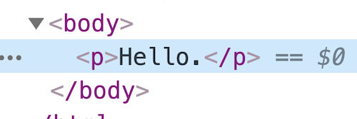
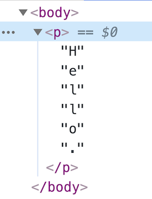
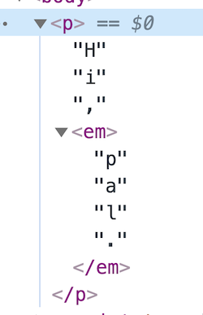
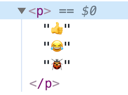

# expand-text-nodes

Expand text within HTML into individual text nodes for each character.

## Why?

By default, text embedded in HTML is rendered as a single text node for each continuous sequence of text. For example, `<p>Hello.</p>` is rendered as a paragraph element with a _single_ text node within:



But if you're handling text character-by-character, or performing a text animation like [TypeIt](https://typeitjs.com/), you might need that text to be broken up as individual text nodes -- one node per character:



This little library does that.

## Usage

Pass a node that contains text into `expandTextNodes()`, and you're done.

```html
<p>Hello.</p>

<script type="module">
  import expandTextNodes from "path/to/expand-text-nodes";

  expandTextNodes(document.querySelector("p"));
</script>
```

It also handles nested HTML. For example, something like this:

```html
<p>Hi, <em>pal.</em></p>

<script type="module">
  import expandTextNodes from "path/to/expand-text-nodes";

  expandTextNodes(document.querySelector("p"));
</script>
```

...will render as something like this:



Works for emojis too!



## The End

There's not much to it.
